# HyperFrames Video Agent Skills

Reusable skills, scripts, and production workflows for agent-led video creation with HyperFrames, FFmpeg, captions, audio sync, and render QA.

Community project from real HyperFrames video work; not an official HyperFrames or HeyGen repository.



## What This Is

This repository is a practical toolkit for coding agents that need to create, edit, assemble, and verify videos as code. It is designed to work alongside HyperFrames, FFmpeg, GSAP, and browser-based composition workflows.

The goal is not to replace HyperFrames. The goal is to capture production patterns that agents repeatedly need but generic web or video docs do not teach well:

- Turning rough video prompts into scene specs.
- Building scenes backward from approved final frames.
- Keeping scene transitions continuous.
- Syncing visuals to narration and phrase timing.
- Burning readable captions.
- Mixing music under voiceover.
- Producing proof frames and contact sheets before claiming a render is done.
- Making surgical final edits without breaking approved sync.

## What This Is Not

This is not an official HyperFrames, HeyGen, or Agentic OS repository.

This repo does not vendor HyperFrames, clone its official docs, or ship a rendering engine. Use HyperFrames for composition and rendering. Use this repo as an agent-facing production layer around it.

## Quick Start For Coding Agents

1. Clone this repository.
2. Read `AGENTS.md`.
3. Load only the relevant skill from `skills/`.
4. Use `templates/` to turn the user request into a concrete scene or timeline spec.
5. Use `scripts/` for fragile repeatable work such as media probing, proof frames, caption files, timeline assembly, and theme scans.
6. Use `workflows/` when the task spans multiple steps.

When a task is subjective, such as caption style, music level, crop choice, or final-frame composition, generate a preview or proof frame before rendering the full final output.

## Quick Start For Codex

Use directly from a project:

```text
Use the skills in /path/to/hyperframes-video-agent-skills to plan and build this HyperFrames video.
```

Or copy selected folders from `skills/` into your Codex skills directory if you want automatic skill discovery.

## Repository Map

| Path | Purpose |
| --- | --- |
| `skills/` | Codex-compatible skills for video agents. |
| `scripts/` | Deterministic utilities for FFmpeg, captions, QA, and theme scans. |
| `templates/` | Scene specs, storyboard specs, caption styles, and timeline manifests. |
| `workflows/` | Step-by-step production workflows agents can follow. |
| `examples/` | Small synthetic examples that do not include private client assets. |
| `media/` | README visuals, diagrams, and lightweight public demo assets. |

## Skill Map

| Skill | Use When |
| --- | --- |
| `end-to-end-video-playbook` | A user wants a full video from prompt to final render. |
| `video-intake-and-storyboard` | A rough request needs to become scene specs and beat timing. |
| `hyperframes-scene-builder` | An agent needs to create or revise HyperFrames compositions. |
| `motion-design-systems` | Visual language, glassmorphism, charts, cards, CTAs, or theme tokens matter. |
| `scene-continuity-and-transitions` | Scenes must start from previous final frames or use camera swipes. |
| `product-demo-integration` | Raw screen recordings need cropping, timing, or transitions. |
| `audio-sync-assembly` | Narration, pauses, phrase timing, and scene retiming need to line up. |
| `captions-and-music-bed` | Captions, subtitle style, music ducking, or final silence need handling. |
| `render-qa-and-surgical-changes` | A final video needs proof frames, contact sheets, or tiny safe edits. |

## Script Examples

Probe a render:

```powershell
python scripts\probe_media.py path\to\final.mp4
```

Extract proof frames and a contact sheet:

```powershell
python scripts\extract_proof_frames.py path\to\final.mp4 `
  --time intro=0.5 `
  --time chart=27.0 `
  --time ending=115.0 `
  --output-dir snapshots\proof `
  --contact-sheet snapshots\proof\sheet.jpg
```

Build ASS captions from simple timing JSON:

```powershell
python scripts\build_ass_captions.py `
  --input examples\minimal-launch-scene\caption-events.json `
  --output captions\sample.ass `
  --style-template templates\caption-style.ass
```

Preview a timeline manifest as an FFmpeg assembly plan:

```powershell
python scripts\timeline_manifest_to_ffmpeg.py examples\minimal-launch-scene\timeline-manifest.json
```

Scan editable source for off-theme colors:

```powershell
python scripts\scan_theme_colors.py compositions --allow "#111111" --allow "#ef6f22"
```

## Example Prompts

```text
Use these video-agent skills to create a 12-second HyperFrames scene from this reference image. Keep the final frame matching the reference and render proof frames before final output.
```

```text
Use the audio-sync workflow to retime these scene renders to narration. The question cards must appear when each spoken question begins.
```

```text
Use the surgical-change workflow. Replace this one label and one audio clip without changing scene timing, music timing, captions, or downstream sync.
```

```text
Use the product-demo integration workflow. The screen recording has zooms, so check whether cropping cuts off important UI before deciding the crop.
```

## Example Project

See `examples/minimal-launch-scene/` for a public-safe toy example that shows:

- A filled scene spec.
- A timeline manifest.
- Caption timing events.
- A surgical change request.

## Contribution Principles

- Add a skill only when it captures reusable production judgment.
- Keep each `SKILL.md` concise and action-oriented.
- Put detailed patterns in `references/`.
- Add scripts for fragile repeated work instead of asking agents to rewrite FFmpeg or caption logic every time.
- Keep examples generic and public-safe.
- Do not commit private footage, private audio, client assets, or generated final videos from closed projects.

## License

Apache-2.0. See `LICENSE`.
